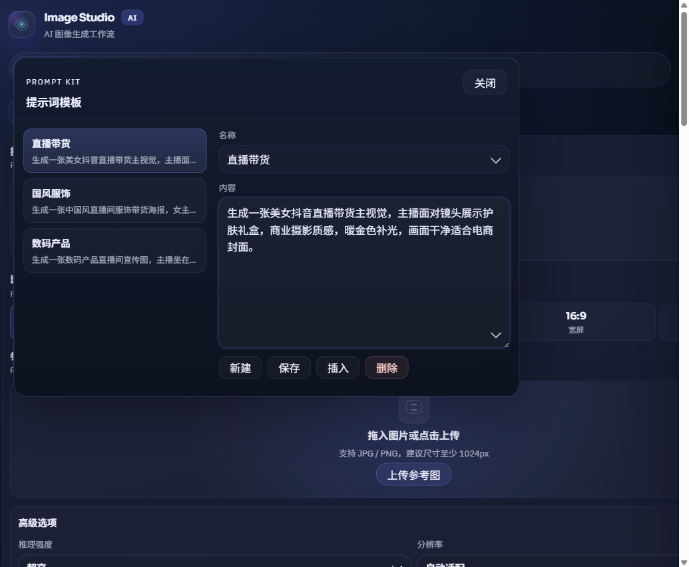

# GPT-Image2-Studio

> 说明：本软件可用于通过中转服务将 `GPT-5.5`、`GPT-5.4`、`GPT-5.4-MINI` 等模型路由成 `image2` 模型使用。理论上请求会按 `image2` 模型处理；但受当前中转路由识别技术限制，部分中转可能无法识别该路由，此时计费会按照实际使用的模型计费。

<div align="center">

**本地优先的 AI 视觉创作工作台**

从提示词生图、参考图编排、局部修图，到电商套图、人物写真、文章插图、PPT 演示文稿与素材资产管理，全部收束在一个浏览器 Studio 中。

[](https://nodejs.org/)


</div>

<p align="center">
  
</p>

## 项目定位

GPT-Image2-Studio 是一个面向创作者、电商运营、内容团队和产品设计工作流的本地 Web 应用。它通过本地 Node 服务、Cloudflare Pages Worker 或 Vercel 部署连接图片生成接口，支持两类调用通道：

| 通道 | 典型用途 | 配置 |
| --- | --- | --- |
| 路由模式 | 通过 `Responses API + image_generation` 调用图片工具 | 独立保存 Base URL、API Key、Responses 模型 |
| 直接调用模式 | 连接兼容生图端点，直接调用图片模型 | 独立保存 Base URL、API Key、图片模型、视觉文本模型 |

它不是单点脚本，而是一套完整工作台：

- 在浏览器里管理提示词、参考图、批量计划、生成队列和历史记录。
- 在本地保存 API 配置与输出结果，避免把私密配置提交到仓库。
- 为电商套图、写真、文章插图、PPT 和画廊资产提供独立记录页。
- 保留命令行单图生成、Cloudflare Pages、Vercel 和 Windows 安装包路径。

## v0.1.5 更新

- Windows 安装包版本同步到 `GPT-Image2-Studio-Setup-v0.1.5.exe`，用于 GitHub Release 分发。
- 调用通道继续细化：直接调用模式新增独立视觉文本模型配置，接口地址支持 `images/generations`、`responses`、`chat/completions` 后缀选择和完整 URL 自动拆分；选择 `responses` 时会用直接调用模式的视觉/文本模型发起 `Responses API + image_generation` 请求。
- 生成队列按模式和通道分别计算并发，配置状态栏会显示总运行数和总排队数。
- 套图结果卡片加入排队中、生成中的稳定 loading 外观，减少补图和 SKU 生成时的布局跳动。
- 胶片栏增加加载、失败和空状态占位，避免历史缩略图尚未加载时界面空白。
- 图片编辑、局部蒙版、参考图角色分析、SKU 多件装 Listing 生成和套图记录细节继续完善。
- README 与 Windows 安装包说明重排，便于新用户安装、开发者验证和发布者上传资产。

## 目录

- [快速开始](#快速开始)
- [功能总览](#功能总览)
- [核心工作流](#核心工作流)
- [配置 API](#配置-api)
- [命令行生成](#命令行生成)
- [输出目录](#输出目录)
- [参数与限制](#参数与限制)
- [本地与云端能力边界](#本地与云端能力边界)
- [构建与发布](#构建与发布)
- [常见问题](#常见问题)
- [项目结构](#项目结构)

## 快速开始

### 使用 Windows 安装包

从 GitHub Release 下载：

```text
GPT-Image2-Studio-Setup-v0.1.5.exe
```

安装后从桌面或开始菜单启动：

```text
GPT-Image2-Studio.cmd
```

安装包内置 `runtime\node.exe`，不要求用户额外安装 Node.js。默认安装目录：

```text
%LOCALAPPDATA%\GPT-Image2-Studio
```

### 本地开发启动

```powershell
git clone https://github.com/aEboli/GPT-Image2-Studio.git
cd GPT-Image2-Studio
cmd /c npm ci
cmd /c npm start
```

启动后打开：

```text
http://localhost:3600
```

如果 `3600` 端口被占用：

```powershell
$env:PORT="3601"
cmd /c npm start
```

Windows 下也可以双击项目根目录的启动器：

```text
launch-studio.cmd
```

停止本地服务：

```text
stop-studio-services.cmd
```

## 功能总览

| 模块 | 路由 | 适合场景 | 亮点 |
| --- | --- | --- | --- |
| 提示词生图 | `/#studio` | 单张海报、产品图、概念图、日常创作 | Prompt Kit、最多 15 张参考图、比例/分辨率/格式控制、实时生成状态 |
| 风格迁移 | `/#style-transfer` | 保留主体内容，迁移视觉风格 | 源图和风格图分槽上传，生成前自动构造保留内容的提示词 |
| 融图分析 | `/#reference-analysis` | 多参考图关系分析、组合构图 | 先分析参考图关系，再生成可直接用于生图的目标提示词 |
| 图片拆解 | `/#image-decomposition` | 产品结构图、设备拆解、包装说明 | 单张图生成结构化信息图，支持两侧说明卡片和目标语言 |
| 图片编辑 | `/#image-edit` | 整图编辑、局部修图、区域重绘 | 单源图编辑、多区域画布蒙版、每区独立指令、一次合并或逐区精修 |
| 快速溶图 | `/#quick-blend` | A/B 产品批量融合、多组素材配对 | A/B 必选、C/D 可选，按同序号配对生成并写入普通画廊 |
| 图片压缩 | `/#image-compress` | 本地批量压缩、格式转换、尺寸压缩 | 纯浏览器处理，支持质量模式、目标体积模式、尺寸调整和下载结果 |
| 套图模式 | `/#creation` | 电商商品主图、卖点图、SKU 补图 | 4-18 张计划、1577 个四级类目模板、Logo 控制、自动补图、Listing Agent |
| 写真模式 | `/#portrait` | 人物写真、头像、形象照、动作组图 | 人物分析、服装道具资产、动作预览、1-100 张写真计划 |
| 文章插图 | `/#article-illustration` | 长文配图、分镜插图、系列内容图 | 文章包解析、风格圣经、人物/场景设定、参考图和正式插图计划 |
| PPT 生成 | `/#ppt` | 文档转演示、主题成稿、逐页配图 | 文档分析、逐页生图、补齐缺页、页面编辑、PPTX 导出 |
| 瀑布画廊 | `/#gallery` | 查找、复用、下载普通生成资产 | 日期分页、搜索、预览、元数据、调用模式记录 |
| 记录中心 | `/#creation-record` 等 | 管理套图、写真、文章、PPT 历史 | 继续失败项、复制提示词、导出清单、打开本地文件夹 |

## 核心工作流

### Studio 创作区

Studio 是默认入口，用于快速生图、风格迁移、参考图编排和图片拆解。它适合从一个提示词开始，也适合上传多张参考图后让系统先分析关系，再进入正式生成。生成状态会记录比例、分辨率、调用模式和中转地址，便于复盘不同通道的输出。

### 图片编辑与局部蒙版

图片编辑模式支持上传一张源图后进行整体编辑。需要精修时，可以在画布上新增多个区域，用画笔涂抹需要修改的位置，并为每个区域填写独立指令。

局部编辑有两种策略：

- `一次合并（快）`：把所有区域合并为一个 alpha mask，只调用一次图片编辑接口。
- `逐区精修（准）`：按区域顺序多次编辑，把上一轮输出作为下一轮源图，最后只保存最终结果。

导出给上游的源图和 mask 会规范化为同尺寸 PNG。透明像素代表可编辑区域，不透明像素保护原图其余部分。

### 电商套图与 Listing Agent

套图模式面向单个商品生成营销图。填写商品名、描述、卖点、类目、视觉语言和输出参数后，可以生成 4 到 18 张基础营销图，并在需要时继续补齐 SKU 图或失败项。

套图模式包含：

- 1577 个四级电商类目模板。
- 参考图用途识别和风格参考图分离。
- Logo 单独上传、Logo 素材库、批量加 Logo。
- 单图提示词微调、历史套图复用、未生成图像补齐。
- Amazon US 英文 Listing Agent，支持父 Listing 草稿、变体数量证据、五点描述、搜索词和复核提示。

### 批量与记录

快速溶图用于批量融合多组产品图，A/B 组必选，C/D 组可选，系统按 `A1+B1`、`A2+B2` 的顺序逐对生成。普通生成、风格迁移、参考图编排、图片拆解、图片编辑和快速溶图会进入瀑布画廊；套图、写真、文章插图和 PPT 有独立记录页，便于继续失败项、复制提示词、导出历史和复用旧任务。

## 配置 API

右下角配置面板会保存常用 API 参数，并按当前调用通道发送请求。

| 配置项 | 默认值 | 说明 |
| --- | --- | --- |
| 生图调用通道 | 路由模式 | 路由模式通过 `Responses API` 调用 `image_generation`；直接调用模式使用独立生图端点 |
| 路由模式接口地址 | `https://api.openai.com/v1` | 可替换为兼容 Responses API 的私有端点 |
| 路由模式接口后缀 | `responses` | 常规路由模式使用 `responses`；如果供应商只兼容 Chat Completions 生图协议，可改为 `chat/completions` |
| 路由模式 API Key | 空 | 本地保存，不提交到仓库 |
| 路由模式 Responses 模型 | 本地默认 `gpt-5.4`，Cloudflare 默认 `gpt-5.5` | 负责文本规划、结构化输出和调用图片工具 |
| 直接调用模式接口地址 | `https://api.openai.com/v1` | 可替换为兼容生图接口的私有端点 |
| 直接调用模式接口后缀 | `images/generations` | 常规直接生图使用 `images/generations`；如果供应商支持 Responses 或把生图结果放在 Chat Completions 响应里，可改为 `responses` 或 `chat/completions` |
| 直接调用模式 API Key | 空 | 可与路由模式分开保存 |
| 直接调用模式生图模型 | `gpt-image-2` | 可通过模型列表选择或手动填写 |
| 直接调用模式视觉文本模型 | `gpt-5.5` | 用于参考图分析、规划和文本视觉任务；当直接调用模式接口后缀为 `responses` 时，也作为 Responses 请求模型 |
| 推理强度 | `xhigh` | 可选 `low` / `medium` / `high` / `xhigh` |

### 接口后缀怎么选

Studio 会把请求地址拆成 `Base URL + 接口后缀`。官方 OpenAI API 的完整地址分别是 `https://api.openai.com/v1/responses`、`https://api.openai.com/v1/chat/completions`、`https://api.openai.com/v1/images/generations` 和 `https://api.openai.com/v1/images/edits`；在 Studio 里，接口地址输入框通常只填写到 `/v1`，后缀由右侧下拉框选择。

| 后缀 | 什么时候用 |
| --- | --- |
| `responses` | 路由模式默认值，也可用于直接调用模式连接兼容 Responses API 的中转或供应商。它会使用 `image_generation` 工具，由对应通道的视觉/文本模型负责理解提示词、参考图和多步流程。 |
| `chat/completions` | 兼容供应商只提供 Chat Completions 风格的视觉/生图协议时使用。路由模式和直接调用模式都可以选择它；Studio 会按 Chat Completions 请求体发送，并从返回消息里提取图片。 |
| `images/generations` | 直接调用模式默认值。适合供应商提供标准图片生成端点，Studio 会直接把提示词、尺寸、质量、格式和生图模型发给图片模型。 |
| `images/edits` | 图片编辑专用端点。普通生图不要选它；进入 `/#image-edit` 后，Studio 会在上传源图或 mask 时自动调用 `/images/edits`。如果供应商只给了编辑端点完整 URL，可以粘贴它来提取同一个供应商的 Base URL。 |

如果供应商给的是完整 URL，可以直接粘贴到接口地址输入框。保存时 Studio 会识别末尾的 `responses`、`chat/completions`、`images/generations` 或 `images/edits`，把前半段规范化保存为 Base URL，把末尾保存为对应通道的接口后缀，并丢弃 URL 里的查询参数和 hash。例如 `https://vendor.example/openai/v1/chat/completions?token=debug` 会保存为 Base URL `https://vendor.example/openai/v1`、后缀 `chat/completions`。如果末尾不是已知后缀，Studio 会把它当作 Base URL 处理，并在缺少 `/v1` 时自动补上 `/v1`，后缀继续使用当前下拉框选择。

隐私默认值：

- 路由模式与直接调用模式的 API Key、私有 Base URL 默认只保存在本机 `.local/config.json` 或浏览器本地配置中。
- `.local/`、`output/`、`artifacts/`、`dist/`、日志、构建产物和 `node_modules/` 不会提交到 GitHub。
- 生成结果默认写入 Windows 图片目录，不混入源码目录。

## 命令行生成

```powershell
$env:OPENAI_API_KEY="你的 API Key"
$env:OPENAI_BASE_URL="https://api.openai.com/v1"
$env:RESPONSES_MODEL="gpt-5.4"

cmd /c npm run generate -- --prompt "一张产品海报，明亮商业摄影，干净背景" --size "1024x1536" --quality "high" --format "jpeg"
```

查看命令行帮助：

```powershell
cmd /c npm run help
```

## 输出目录

本地服务默认把生成结果保存到 Windows 图片目录：

```text
C:\Users\<你的用户名>\Pictures\YYYY-MM\MM-DD\
```

不同模式会写入独立子目录：

```text
YYYY-MM-DD-prompt\
YYYY-MM-DD-style-transfer\
YYYY-MM-DD-reference-analysis\
YYYY-MM-DD-image-decomposition\
YYYY-MM-DD-image-edit\
YYYY-MM-DD-quick-blend\
YYYY-MM-DD-creation\HHMM-商品名-短ID\
YYYY-MM-DD-portrait\HHMM-人物名-短ID\
YYYY-MM-DD-article\文章名-短ID\
YYYY-MM-DD-ppt\PPT名称-短ID\
```

记录清单默认写入：

```text
Pictures\json\creation-sets\
Pictures\json\portrait-sets\
Pictures\json\article-illustration-sets\
Pictures\json\ppt-decks\
```

命令行生成默认写入项目内：

```text
output/generated-时间戳.<ext>
```

## 参数与限制

| 项目 | 当前限制 |
| --- | --- |
| 普通参考图 | 最多 15 张 |
| 融图分析参考图 | 最多 15 张 |
| 批量 Logo 源图 | 最多 15 张 |
| 图片编辑源图 | 1 张 |
| 图片编辑局部蒙版 | 每个源图最大 50 MB；源图和 mask 会规范化为同尺寸 PNG |
| 套图参考图 | 最多 15 张 |
| 套图风格参考图 | 最多 3 张，且与套图参考图合计最多 15 张 |
| 写真人物参考图 | 最多 3 张 |
| 写真动作参考图 | 最多 3 张 |
| 写真服装/道具/配饰参考图 | 最多 9 张 |
| 写真计划数量 | 1-100 张 |
| 套图基础数量 | 4 / 6 / 8 / 10 / 12 / 14 / 16 / 18 张，SKU 补图可追加 |
| PPT 页数 | 1-20 页 |
| 排队任务数 | 不设硬上限；本地队列按模式与通道并发上限逐批处理 |
| 并发生成数 | 默认最多 15 个 |
| 输出格式 | PNG / JPG |

常用比例和尺寸：

| 比例 | `auto` 默认尺寸 | 可选尺寸 |
| --- | --- | --- |
| `1:1` | `1024x1024` | `1024x1024`、`1536x1536`、`2048x2048`、`2816x2816` |
| `5:4` | `1280x1024` | `1280x1024`、`1920x1536`、`2560x2048`、`3120x2496` |
| `9:16` | `720x1280` | `720x1280`、`1152x2048`、`2016x3584`、`2151x3824`、`2160x3840` |
| `21:9` | `1680x720` | `1680x720`、`1916x821`、`2688x1152`、`3360x1440`、`3824x1639`、`3832x1642`、`3840x1646` |
| `16:9` | `1280x720` | `1280x720`、`2048x1152`、`3584x2016`、`3824x2151`、`3840x2160` |
| `4:3` | `1024x768` | `1024x768`、`1536x1152`、`2048x1536`、`3072x2304` |
| `3:2` | `1536x1024` | `1536x1024`、`2304x1536`、`3072x2048`、`3456x2304` |
| `4:5` | `1024x1280` | `1024x1280`、`1536x1920`、`2048x2560`、`2496x3120` |
| `3:4` | `768x1024` | `768x1024`、`1536x2048`、`1920x2560`、`2304x3072`、`2448x3264` |
| `2:3` | `1024x1536` | `1024x1536`、`1536x2304`、`2048x3072`、`2304x3456` |

高分辨率更容易触发上游超时、失败或没有最终图片结果。日常建议优先使用 1K 到 2K 尺寸，需要大图时再逐档尝试。

## 本地与云端能力边界

| 能力 | 本地 Node | Cloudflare Pages Worker / Vercel |
| --- | --- | --- |
| 普通图片生成 | 支持 | 支持 |
| 风格迁移、融图分析、图片拆解 | 支持 | 支持核心生成 |
| 图片编辑 | 支持整图编辑、局部蒙版、逐区精修、记录和路径回报 | 支持整图编辑和局部蒙版；本地文件夹操作不可用 |
| 图片压缩 | 浏览器本地处理 | 浏览器本地处理 |
| 套图生成 | 支持记录、补图、打开文件夹和路径回报 | 支持生成；本地文件夹操作不可用 |
| 写真生成 | 支持记录、补图、打开文件夹和路径回报 | 支持生成；本地文件夹操作不可用 |
| 文章插图 | 支持计划、参考图、正式插图和记录 | 以部署配置为准 |
| PPT 普通导出 | 支持 | 支持 |
| PPT 可编辑重建 | 需要本地 Presentations artifact-tool runtime | 不加载 artifact-tool，只保留普通 PPTX 并返回不支持提示 |
| 调用模式与元数据 | 本地索引、sidecar 和浏览器缓存保留 `imageRoute` | 生成、模型列表和服务端图片链接按部署配置保留调用模式信息 |
| API Key 存储 | `.local/config.json` 或浏览器本地配置 | 浏览器本地配置或部署侧安全注入 |

## 构建与发布

常用验证命令：

```powershell
cmd /c npm test
cmd /c npm run build:pages
cmd /c npm run sync:public-lib -- --check
git diff --check
```

Cloudflare Pages 构建：

```powershell
cmd /c npm run build:pages
```

构建产物写入：

```text
dist/
```

Windows 安装包构建：

```powershell
cmd /c npm run build:installer
```

安装包产物写入：

```text
artifacts/windows-installer/<build-id>/GPT-Image2-Studio-Setup-v0.1.5.exe
```

发布前确认以下路径没有进入暂存区：

```text
.local/
.env
.env.*
output/
artifacts/
dist/
node_modules/
.vercel/
.playwright-mcp/
*.log
```

发行版号需要与 `package.json`、`package-lock.json`、README、`docs/windows-installer.md` 和安装包文件名一致。

## 常见问题

| 现象 | 常见原因 | 处理方式 |
| --- | --- | --- |
| `npm start` 后中文日志显示乱码 | Windows 控制台没有按 UTF-8 显示输出 | 先打开 `http://localhost:3600` 验证服务；需要看中文日志时用 `cmd /c npm start` |
| 端口 `3600` 被占用 | 本机已有旧服务或其他程序占用端口 | 用 `$env:PORT="3601"; cmd /c npm start`，或双击 `launch-studio.cmd` |
| 页面能打开，但生成时报 API Key 或上游请求错误 | 当前调用通道没有保存 API Key，或 Base URL / 模型配置不正确 | 在右下角配置面板确认路由模式或直接调用模式，并保存对应配置 |
| 拉取后提示找不到依赖模块 | 没安装依赖，或旧 `node_modules` 与 lockfile 不一致 | 在仓库根目录执行 `cmd /c npm ci` |
| 浏览器控制台提示 `/lib/*.mjs` 404 或公共模块不一致 | 开发时改了 `lib/` 但没有同步 `public/lib/` | 执行 `cmd /c npm run sync:public-lib -- --check`；失败时执行 `cmd /c npm run sync:public-lib` |
| 自写 Node 脚本里 `spawn npm` 出现 `spawn EINVAL` | Windows npm shim 在部分执行环境里不能被 Node 子进程直接调用 | 使用 `cmd /c npm ...`，或 spawn `cmd.exe /c npm ...` |

## 项目结构

```text
GPT-Image2-Studio/
|-- docs/                         # 教程、发布说明和执行计划记录
|-- examples/                     # API 请求与 SSE 示例
|-- lib/                          # 本地服务和前端共享逻辑
|-- openspec/                     # 规格变更、设计和验收场景
|-- public/                       # 浏览器工作台、样式、前端模块和内置资产
|   |-- assets/portrait-actions/  # 写真动作预览图
|   `-- assets/portrait-accessories/ # 写真服装道具配饰资产
|-- scripts/                      # 构建、打包和 public/lib 同步脚本
|-- test/                         # Node test 测试
|-- cloudflare-pages-worker.mjs   # Cloudflare Pages API Worker
|-- generate-image.mjs            # 命令行单图生成入口
|-- server.mjs                    # 本地 Web 服务入口
|-- launch-studio.cmd             # Windows 快速启动器
|-- launch-studio.ps1             # Windows PowerShell 启动器
|-- stop-studio-services.cmd      # 停止本地服务脚本
|-- wrangler.jsonc                # Cloudflare Pages 配置
|-- wrangler.api.jsonc            # Worker API 配置
|-- vercel.json                   # Vercel 兼容配置
|-- package-lock.json
`-- package.json
```
