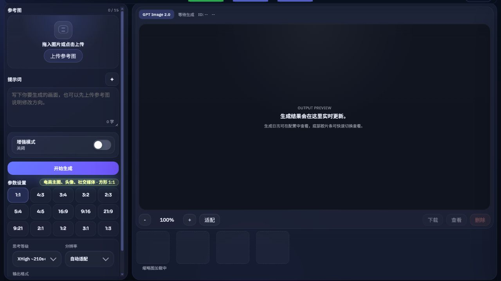
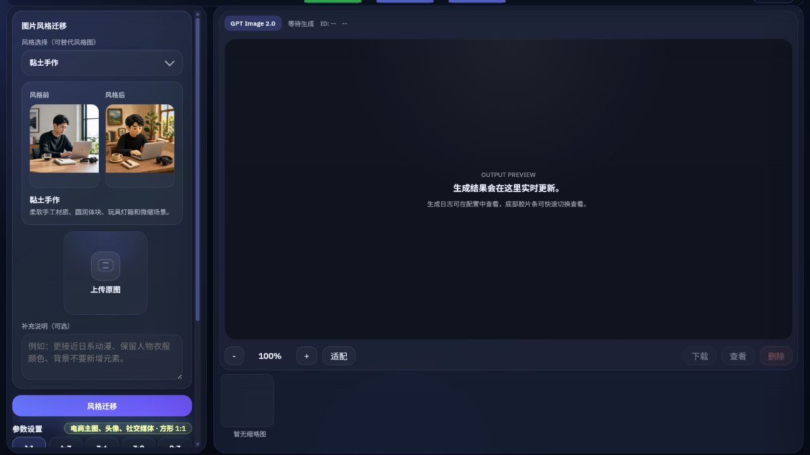
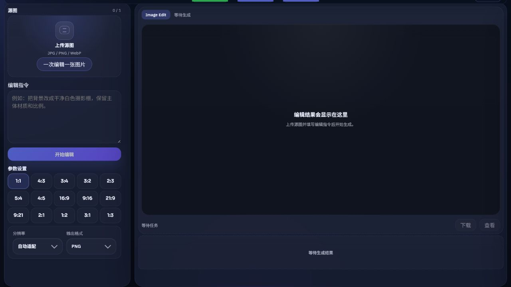
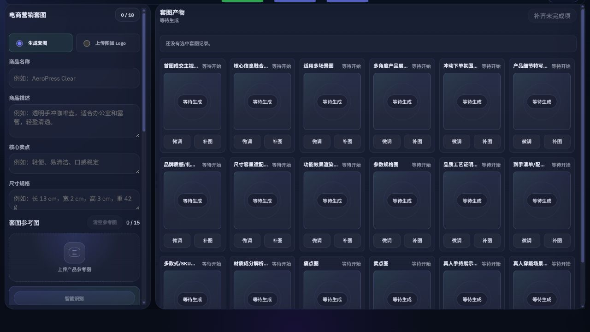
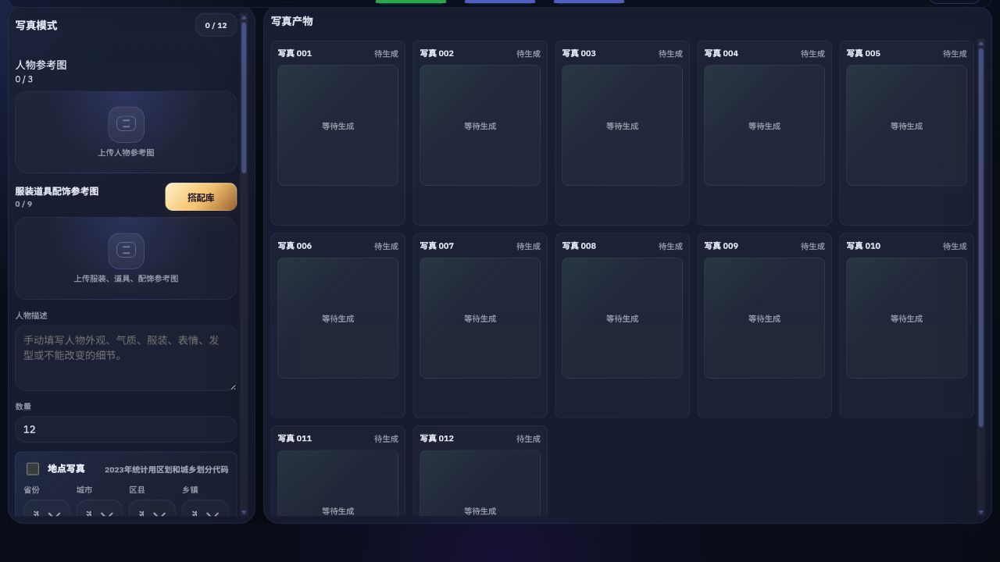
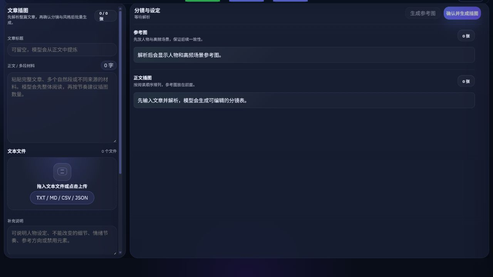
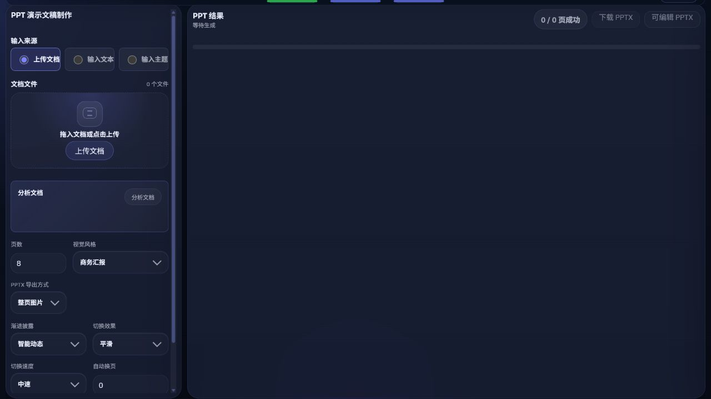
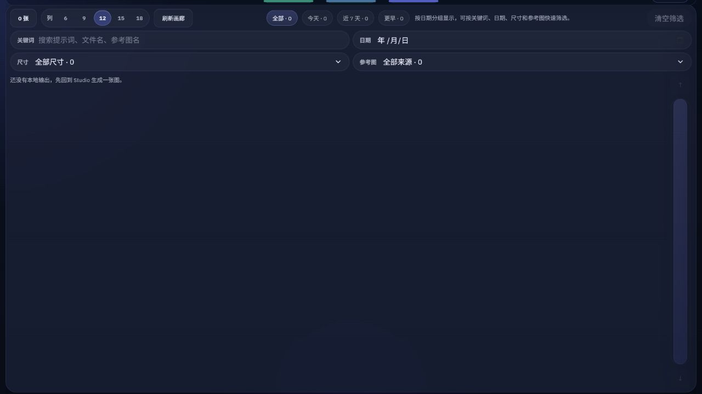

# GPT-Image2-Studio

<div align="center">

[](https://github.com/aEboli/GPT-Image2-Studio/releases)
[](https://nodejs.org/)
[](https://github.com/aEboli/GPT-Image2-Studio/releases)

**A local-first AI image generation and visual production workbench**

Prompt-to-image, reference analysis, editing, ecommerce sets, portraits, article illustrations, PPT generation, and asset history in one browser-based workspace.

Current version: `v0.2.11`

[Chinese README](./README.zh-CN.md)

</div>

## What is included in v0.2.11

- The Temu workbench entry is now a direct entry. The Creation records toolbar button reads `temuexcel导出工作台`, no longer requires ticking any record, and is no longer disabled by an empty selection. Ticked records never trigger an automatic import dialog; use the workbench's own **Import from Studio** action instead.
- The workbench variant section gained an **Add variant** action. Each use appends exactly one editable SKU row that inherits the product-level declared price, dimensions, weight, and stock, without rebuilding the two-variant cartesian matrix or rewriting existing rows.
- Batch quick export moved into the workbench's **Batch quick export** tab.
- The local gallery loads server-generated WebP thumbnails (512px longest edge) instead of full-size originals.
- The main generation preview and the image lightbox reveal a finished image only after the browser has decoded it, fading in from a slight blur. Re-rendering the same image URL keeps it sharp instead of replaying the reveal. Image editing and quick blend share the same behavior.
- The workbench no longer requests `fonts.googleapis.com` or `fonts.gstatic.com`. The interface uses a local system font stack, so the first paint depends on no third-party font host.
- The Windows launcher collects the local TCP listener snapshot once per launch attempt, reuses an occupied port only after the Studio health endpoint succeeds, and otherwise picks the first available candidate port.
- An ecommerce set item that reaches the local stream deadline now aborts only the stream read and keeps polling the original upstream task for up to 120 seconds, so background repair no longer resubmits a task that is still running. Late stream events and stale manifests no longer overwrite an image that was already saved.
- Reference images separate functional-claim evidence from material and structure detail, and dimension facts for multi-colour, multi-size, or multi-unit variants bind to their own variant group instead of collapsing into one global summary.

### Earlier in v0.2.10

- Documentation-only release. It aligns the README version facts with the shipped version: badge, this section, desktop installer and portable ZIP filenames, release-notes link, and build-output paths.

### Earlier in v0.2.9

- Every generation entry point shares one circular liquid loading indicator: prompt-to-image, style transfer, ecommerce sets, portraits, article illustrations, PPT pages, image decomposition, blend analysis, image editing, and quick blend.
- The indicator renders as real liquid. A crest and a counter-ripple travel horizontally, bubbles rise inside, and the level fills continuously between percentages instead of stepping.
- Percentages advance in bands. At `20%` and below each `1%` takes `800ms`; above `20%` every additional `10%` band adds `1500ms` per `1%` (`2300ms` for `21%-30%`, `12800ms` for `91%-99%`), capped at `99%` until the full image is available.
- A queued state was added. Tasks waiting to start show neither a percentage nor a timer; they use still water with a slow breathing ripple and a queued label, then switch to the generating state from `0%`.
- Adjacent queue and filmstrip entries with identical placeholders now have a visible separator.
- Under `prefers-reduced-motion: reduce`, breathing, crest travel, bubbles, and waiting ripples stop while level and percentage text still track progress.
- Ecommerce set final images are delivered in chunks, failure and malformed-response recovery paths were tightened, and a generated-image validation module was added.
- Multi-reference edits on the direct route no longer misalign reference relationships.
- Prompt-to-image queues bound their capacity and enqueue locally instead of rejecting once concurrency is reached.
- Retried prompt attempts keep their earlier preview cards instead of overwriting them.

### Earlier in v0.2.8

- A quiet lower-left workbench version label backed by the root package version, plus a maintained patch command that increments each main application update by exactly `0.0.1` and checks all current version facts for drift.
- Prompt Kit now restores reusable long-term Prompt Agent history as stable local templates without overwriting edits or recreating templates the user dismissed. Its desktop placement stays beside the prompt controls, while hover and focus help remains above panels and dialogs.
- Prompt-to-image keeps its initial ten-image history baseline and appends only successful results from the current page session, up to fifty visible thumbnails. The loading preview uses continuous, phase-aware liquid motion without presenting visual motion as generation progress.
- Image inspection keeps a stable desktop frame across landscape, square, and portrait images. Structured prompt arrays are grouped under their shared field so repeatable details are easier to scan.
- A persistent Creation record workspace with an independently scrollable record list and image/Listing detail pane on wide screens, plus a collapsible selector on small screens.
- Temu-compatible Excel export for selected Creation records. Each SKU uses one row, existing public HTTPS images are reused, and local images can optionally be uploaded through a Cloudinary unsigned upload preset.
- Explicit export preflight. Missing Listing fields, price, dimensions, weight, stock, origin, or public image URLs stay empty and are listed in an `Export issues` worksheet instead of being guessed.
- Evidence-aware Listing normalization, product/package measurement boundaries, safer buyer-facing titles, and SKU image names that do not expose internal part numbers or source filename codes.
- Prompt/reference reuse improvements: independent clear actions, drag-and-drop reference images, recent-result reuse, and filename plus relative-path context in the image inspector.
- A Vercel Serverless entry point that installs production dependencies and avoids Electron-only initialization in cloud functions. Vercel deployments use temporary storage and do not provide the local filesystem workflow.
- Interrupted Responses streams first recover the original upstream result by response ID and bounded polling. If the final result still cannot be confirmed, the local app reuses the current task's original input for one automatic retry, displays `重试中` (`Retrying`), and never sends a third generation request after that retry is exhausted.
- Prompt generation supports a fifteen-task pending window with ten shared concurrent slots across the supported prompt routes, while keeping the preview surface compact.
- The retired Cloudflare Pages/Worker/R2/Queue path and its active deployment claims have been removed; local Node.js, Windows desktop, Windows browser installer, and Vercel remain documented separately.

## Why this workbench

GPT-Image2-Studio is designed for creators, ecommerce operators, designers, and content teams who need more than a single image prompt. It keeps references, plans, queued jobs, retries, generated assets, and request metadata together while preserving a local-first trust boundary.

The same application can run in three ways:

| Runtime | Best for | Data boundary |
| --- | --- | --- |
| Local Node.js service | Full daily workflow and development | Configuration, records, and outputs stay on the local machine by default |
| Windows desktop app | A dedicated window, taskbar identity, and standard uninstall flow | Electron provides the runtime; closing the last window stops the local service |
| Windows browser installer | The legacy browser-launch workflow | The installer includes `node.exe` and opens the default browser |

The repository also contains a Vercel configuration. Vercel functions use temporary storage, so Preview validation is required for long jobs, SSE, and file lifecycles before production deployment.

## Core capabilities

### Image creation

- **Prompt-to-image** with up to 15 reference images, prompt enhancement, aspect-ratio presets, explicit pixel sizes, PNG/JPG output, and live progress.
- **Style transfer** with a separate source image, style reference, built-in presets, and a two-image before/after comparison viewer.
- **Reference analysis** that turns 1-15 images into structured subjects, relationships, risks, and an applied generation prompt.
- **Image decomposition** for products, devices, and packaging, producing structured callouts and selling-point visuals.
- **Image editing** for whole-image changes or multiple local masks, with merged or sequential region execution.
- **Quick blend** that pairs A/B/C/D material groups by index for repeatable batch composition.
- **Browser-local compression** with resizing, format conversion, quality/target-size controls, and no upload to the image service.

### Commerce and content workflows

- **Ecommerce sets** with platform, category, product facts, audience, SKU, language, carousel roles, frozen plans, retries, and Listing drafts. A separate logo-batch branch adds one uploaded Logo to up to 15 source images. Nineteen platform profiles are included; the generic baseline keeps 18 native carousel slots.
- **Portrait mode** for consistent people, actions, clothing, props, locations, framing, and 1-100 image batches.
- **Article illustration mode** for text packages, style bibles, character and scene references, reading-order storyboards, and final illustrations.
- **PPT generation** from PDF, DOCX, PPTX, TXT, Markdown, CSV, pasted text, or a topic; supports 1-20 pages, page repair, image-based PPTX, and editable reconstruction.

### Assets and operations

- Waterfall gallery and a shared lightbox with fit, zoom, pan, download, deletion, prompt review, and request-parameter inspection.
- Separate records for Creation sets, portraits, article illustrations, and PPT decks.
- Background queue status, progress, structured errors, and retry of failed items.
- Prompt Kit, Prompt Agent image-to-prompt output, Logo library, portrait outfit/prop library, and model selection controls.
- Dark/light themes, Chinese/English UI, and responsive desktop, tablet, and mobile layouts.

## Interface preview

These screenshots come from isolated browser sessions of the current workbench. They show layout and interaction structure; prompts and generated results are examples, not a promise of fixed upstream model output.

### Prompt-to-image



### Style transfer



### Image editing



### Ecommerce set planning



### Portrait mode



### Article illustrations



### PPT generation



### Gallery



## Workflow map

| Workflow | Inputs | Result |
| --- | --- | --- |
| Prompt-to-image | Prompt, up to 15 references, ratio, size, format | PNG/JPG assets, progress, filmstrip, download, and metadata review |
| Style transfer | Source image, style image or preset, optional prompt | A generated result plus a before/after preset comparison |
| Reference analysis | 1-15 images, analysis language, target description | Structured analysis and an optional generation prompt/result |
| Image decomposition | One product/device/package image and a decomposition brief | Callout or infographic-style PNG/JPG and saved analysis |
| Image editing | Source image, whole-image instruction, or local masks | Edited PNG/JPG, region retry, and lightbox review |
| Quick blend | Indexed A/B groups, optional C/D groups, layout settings | One independent generation task per matched group |
| Ecommerce set | Product facts, references, platform, category, SKU | Frozen carousel plan, generated set, Listing draft, and record; separate logo-batch processing for uploaded source images |
| Portraits | Person/action/clothing references, location, style, framing, count | A consistent 1-100 image series and retryable record |
| Article illustrations | Text package or pasted article, style and content type | Style bible, reference cards, storyboard, and PNG illustrations |
| PPT | Documents, text, or topic; 1-20 pages | Page PNGs, image-based PPTX, or editable reconstructed PPTX |

## Temu Excel export

Select one or more Creation records, open **temuexcel导出工作台**, and switch to **Batch quick export**. The exporter uses the versioned template shipped in the repository, writes one row per SKU, reuses public HTTPS image URLs, and can convert local images through a Cloudinary unsigned upload (`cloudName` plus `uploadPreset`). It never asks for or stores a Cloudinary API key, API secret, signature, Authorization header, or browser cookie.

This is a local Node.js / Windows desktop capability. It does not log in to Temu, import the workbook, solve verification challenges, or publish a product. Missing product facts or public images remain blank and are reported in the `Export issues` sheet. Review the workbook and Temu's current validation results before uploading.

### Temu listing workbench

**temuexcel导出工作台** opens the built-in Temu listing workbench as a full-screen overlay. No record selection is required, and selected Creation records never trigger an automatic import. There is no second service to start and no second port to manage. The workbench opens on its main editing interface; use its explicit **Import from Studio** action when you want to bring in existing Creation records. It lets you fill in the 51 template columns by hand per product, maintain the two-variant SKU matrix, override price, dimensions, weight and stock per SKU, manage carousel and packaging images, and export the workbook directly.

The overlay has two sibling tabs:

- **Listing workbench** — the default tab, for manual per-field editing and export. Its workbook keeps the template's original two sheets.
- **Batch quick export** — the existing batch flow. Preflight, strict versus fill-in export modes, the batch defaults form, and per-record export state write-back all behave exactly as before, and its workbook still carries the `Export issues` sheet.

Closing the overlay only hides it: in-progress drafts, scroll position, and not-yet-uploaded local image previews survive, so reopening resumes where you left off. Workbench drafts live in the current browser; use the workbench's own draft backup export/restore to move them across browsers or reinstalls.

The workbench only reads existing Creation records. It never starts a generation job, logs in to a store, or publishes a product. SKU images must be square and larger than 800 pixels on both sides, carousel images are capped at 10 and packaging images at 6, and every template image field must be a public HTTPS URL verified by the local server.

## Product image collector extension

The repository includes an optional Chrome/Edge extension for supported 1688, Amazon, Temu, TikTok Shop, SHEIN, and Dajian Yuncang consumer product pages. It can collect main, detail, and named SKU images, filter groups, preview originals, copy selected images to Studio, and download individual or product-folder batches.

The extension reads supported product regions only after the user starts a collection. It does not read cookies, API keys, passwords, or other credentials. Studio only downloads a reviewable ZIP; Chrome/Edge still requires the user to load or reload the extension manually. See the [extension guide](./extensions/product-image-collector/README.md).

## Quick start

### Run from source

Requirements:

- Node.js 20 or newer for the local service.
- An OpenAI API key or credentials for a compatible image service.

```powershell
git clone https://github.com/aEboli/GPT-Image2-Studio.git
cd GPT-Image2-Studio
cmd /c npm ci
cmd /c npm start
```

Open `http://127.0.0.1:3600`. To use another free port:

```powershell
$env:PORT="3601"
cmd /c npm start
```

On Windows, `launch-studio.cmd` starts the workbench and `stop-studio-services.cmd` stops this project's services on ports 3600-3606.

### Windows desktop app (recommended)

Download `GPT-Image2-Studio-Desktop-Setup-v0.2.11-x64.exe` from [GitHub Releases](https://github.com/aEboli/GPT-Image2-Studio/releases). The Electron app runs in a dedicated window and includes its runtime, so Node.js is not required after installation. See [Windows desktop documentation](./docs/windows-desktop.md).

For a no-install desktop copy, download `GPT-Image2-Studio-Portable-v0.2.11-x64.zip`, extract the complete archive, and run `GPT-Image2-Studio.exe` at the archive root. Keep the extracted files together; this portable copy does not create an installer entry or uninstall record.

For desktop development, Electron 43 requires Node.js 22.12 or newer:

```powershell
cmd /c npm ci
cmd /c npm run desktop
```

### Windows browser installer

The legacy browser-installer flow remains documented for local builds, but the `v0.2.11` GitHub Release does not include its IExpress package. Use the desktop NSIS installer or the portable ZIP above; see [Windows installer documentation](./docs/windows-installer.md) only if you need to build the compatibility flow yourself.

## Configuration

### Configure in the UI

Open **Configuration** and choose the route mode, direct-call mode, or Gemini model channel. In **direct-call mode**, fill the image-generation provider and the text/vision provider separately. Each group has its own Base URL, API key, endpoint suffix, and model; the image group is used for generation/editing, while the text/vision group is used for analysis and other model calls. API keys are kept in local private storage and public configuration responses expose only configured status and a mask. Use **Test connection** or the matching **Fetch Models** button before a long generation job. Gateway behavior varies, so a successful connection test is not proof that every editing, reference, or maximum-size request is supported.

Existing installations using `directBaseUrl`, `directApiKey`, `directEndpointPath`, `directImageModel`, and `directResponsesModel` continue to work as a bounded compatibility fallback. New channel-specific values take precedence independently, and a blank key input keeps the previously saved private key.

Common endpoint suffixes:

| Suffix | Typical use |
| --- | --- |
| `responses` | Responses-style routed requests |
| `chat/completions` | Chat Completions-compatible gateways |
| `images/generations` | Direct image generation |
| `images/edits` | Image editing requests |

Direct-call environment variables are split by purpose:

| Variables | Purpose |
| --- | --- |
| `DIRECT_IMAGE_BASE_URL`, `DIRECT_IMAGE_API_KEY`, `DIRECT_IMAGE_ENDPOINT_PATH`, `DIRECT_IMAGE_MODEL` | Direct image-generation and editing channel |
| `DIRECT_TEXT_BASE_URL`, `DIRECT_TEXT_API_KEY`, `DIRECT_TEXT_ENDPOINT_PATH`, `DIRECT_TEXT_MODEL` | Direct text/vision analysis channel |
| `DIRECT_BASE_URL`, `DIRECT_API_KEY`, `DIRECT_ENDPOINT_PATH`, `DIRECT_RESPONSES_MODEL` | Legacy fallback accepted for existing configurations |

### Environment variables

Copy `.env.example` for a local starting point. Important variables include:

```text
OPENAI_API_KEY=your_api_key_here
OPENAI_BASE_URL=https://api.openai.com/v1
RESPONSES_MODEL=gpt-5.4-mini
DIRECT_IMAGE_BASE_URL=https://api.openai.com/v1
DIRECT_IMAGE_API_KEY=
DIRECT_IMAGE_ENDPOINT_PATH=images/generations
DIRECT_IMAGE_MODEL=gpt-image-2
DIRECT_TEXT_BASE_URL=https://api.openai.com/v1
DIRECT_TEXT_API_KEY=
DIRECT_TEXT_ENDPOINT_PATH=responses
DIRECT_TEXT_MODEL=gpt-5.4-mini
HOST=
PORT=3600
IMAGE_STUDIO_OUTPUT_DIR=
IMAGE_STUDIO_LOCAL_DATA_DIR=
IMAGE_STUDIO_REQUEST_TOKEN=
IMAGE_STUDIO_ALLOW_INSECURE_REMOTE_HTTP=0
IMAGE_STUDIO_DISABLE_DNS_FALLBACK=0
IMAGE_STUDIO_DNS_FALLBACK_SERVERS=
```

The Node service keeps the system `dns.lookup` path first. When system resolution fails, the fallback sequence defaults to `223.5.5.5`, `1.1.1.1`, then the system's existing servers. Set `IMAGE_STUDIO_DISABLE_DNS_FALLBACK=1` to disable it, or provide a comma-, semicolon-, or space-separated list in `IMAGE_STUDIO_DNS_FALLBACK_SERVERS`.

### Remote access

The default listener is `127.0.0.1`. Do not expose it directly to the public internet. Non-loopback requests require the startup token through HTTP Basic, `Authorization: Bearer <token>`, or `X-Image-Studio-Token: <token>`. A reverse proxy must terminate TLS, authenticate users, enforce request limits, and inject an explicit fixed token for each backend request. Read [SECURITY.md](./SECURITY.md) before enabling LAN or hosted access.

## Deployment and packaging

### Vercel

The repository includes `vercel.json` and a standard request handler for Serverless functions. Vercel uses ephemeral filesystems and cloud-specific request lifecycles. Validate a Preview deployment, SSE completion, long-running jobs, and `/api/config` before a production deployment.

### Windows packages

```powershell
cmd /c npm run build:desktop
cmd /c npm run build:installer
```

Artifacts are written below `artifacts/desktop/` and `artifacts/windows-installer/`. Build output, runtime data, logs, and credentials are ignored and must not be committed.

## Local data and privacy

The local service stores generated images by date under:

```text
%USERPROFILE%\Pictures\YYYY-MM\MM-DD\
```

Typical workflow folders include `prompt`, `style-transfer`, `reference-analysis`, `image-decomposition`, `image-edit`, `creation`, `portrait`, `article`, and `ppt`. Record indexes are normally under `%USERPROFILE%\Pictures\json\`; private service configuration is under `.local/config.json`, or under the Electron app-data directory for the desktop build.

API keys, prompts, references, generated images, manifests, and request logs can contain sensitive information. Keep `.env`, `.local/`, `output/`, `outputs/`, `artifacts/`, `dist/`, and real generation records out of commits. Third-party gateways receive the credentials and media that you send to them; review their data policies independently.

Generated content still needs human review for factual accuracy, brand rules, portrait rights, copyright, platform policy, and unsupported claims. The app does not automatically log in to Temu or publish listings.

## Limits and compatibility

The UI exposes conservative application candidates, not a guarantee from every upstream model or gateway. Actual accepted parameters, billing, output pixels, image formats, and platform review rules are controlled by the selected provider.

| Area | Current application boundary |
| --- | --- |
| Prompt references | Up to 15 images; a session has up to 15 parallel task slots |
| Style transfer | One source image plus one style reference or built-in preset |
| Image-edit masks | Each local mask is limited to 50 MB and normalized to the source dimensions |
| Ecommerce SKU combinations | Up to 20 combinations; frozen plans are limited to 64 items and 4 MiB serialized size |
| Portrait batches | 1-100 images; the default is 12 |
| PPT pages | 1-20 pages; the default is 8 |
| Output formats | PNG or JPG for generated images; browser compression can also produce WebP |

Large images, high resolutions, and large batches increase browser memory use and the chance of upstream timeouts or rate limits. Start with an automatic or medium size and a small batch, then increase scale after the selected channel is proven compatible.

## Project structure

```text
GPT-Image2-Studio/
|-- desktop/                     # Electron main process and security policy
|-- docs/                        # Installation, release, design, and screenshots
|-- examples/                    # API and SSE examples
|-- lib/                         # Server and browser-shared modules
|-- openspec/                    # Current specs and in-progress changes
|-- public/                      # Browser UI, styles, modules, and assets
|-- scripts/                     # Sync, cloud, and Windows packaging scripts
|-- test/                        # Node.js tests
|-- server.mjs                   # Local Node.js service
|-- generate-image.mjs           # CLI image-generation entry point
|-- package.json
`-- package-lock.json
```

## Development and verification

```powershell
cmd /c npm run dev
cmd /c npm run desktop
cmd /c npm run help
cmd /c npm run sync:public-lib
cmd /c npm test
cmd /c npm run check:release
```

Before a pull request or release, run the maintained contract from a clean checkout or isolated worktree:

```powershell
cmd /c npm ci
cmd /c npm test
cmd /c npm run sync:public-lib -- --check
cmd /c npm run check:release
cmd /c npx --no-install openspec validate --all --strict
git diff --check
```

Desktop and installer changes additionally require `npm run test:desktop-smoke`, `npm run build:desktop`, and `npm run build:installer`. See [CONTRIBUTING.md](./CONTRIBUTING.md) for the OpenSpec workflow and dirty-worktree rules.

## Releases

- The source and lockfile versions are authoritative; tags use `v<version>`.
- Current release notes: [v0.2.11](./docs/releases/v0.2.11.md).
- Windows packages are distributed through [GitHub Releases](https://github.com/aEboli/GPT-Image2-Studio/releases). Check the release notes for hashes and signing status.
- `npm run check:release:strict` requires a clean worktree and a matching tag on the current commit.

## Documentation

- [Chinese README](./README.zh-CN.md)
- [Windows desktop app](./docs/windows-desktop.md)
- [Windows browser installer](./docs/windows-installer.md)
- [Product image collector extension](./extensions/product-image-collector/README.md)
- [Security policy](./SECURITY.md)
- [Contribution and maintenance guide](./CONTRIBUTING.md)
